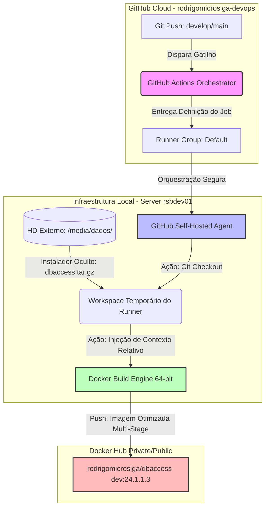

# 🐳 TOTVS DBAccess - Fábrica de Imagens CI/CD

Este repositório é um componente isolado da arquitetura **TOTVS Protheus Modern DevOps** [https://github.com/rodrigomicrosiga-devops/totvs-protheus-modern-devops]. Seu papel exclusivo é atuar como uma fábrica de imagens imutáveis, compilando o binário do License Server Virtual e publicando-o diretamente no Docker Hub via CI/CD.

---

## 🏗️ Arquitetura do Pipeline Híbrido (CI/CD)

O pipeline foi desenhado seguindo as melhores práticas de governança corporativa e segurança da informação: o código-fonte e as instruções de esteira permanecem públicos e transparentes para auditoria, enquanto os arquivos binários pesados e proprietários são mantidos estritamente sob controle local, injetados dinamicamente via **Self-Hosted Runner**.



### 🛠️ Especificações Técnicas da Imagem

A esteira de build utiliza o conceito de `Multi-Stage Build` para garantir o menor tamanho de camada final possível e o máximo isolamento de metadados:

`Base Runtime`: Ubuntu 22.04 LTS (64-bits Nativo).

`Versionamento Imutável`: Identificado rigidamente via metadados da imagem.

`Dependências Isoladas`: Instalação limpa restrita à biblioteca nativa de sistema libuuid1.

`Exposição de Portas`: Porta padrão do `DDAccess` (`7890`) documentada explicitamente.

### ⚙️ Estrutura do Pipeline Portável

Para garantir que a receita do pipeline permaneça agnóstica a caminhos absolutos de discos do sistema hospedeiro, a esteira utiliza resolução de contexto relativo e variáveis internas do ciclo de vida do `GitHub Actions`:

```yaml
# Trecho do resolvedor de contexto no workflow (.github/workflows/docker-publish.yml)
- name: Resgatar Instalador Local no Workspace
  run: |
    cp ../../dbaccess.tar.gz . 2>/dev/null || cp "${{ github.workspace }}/../dbaccess.tar.gz" . 2>/dev/null || cp /media/rodrigo/dados/docker-protheus-dbaccess/dbaccess.tar.gz .
```

Isso garante que, mesmo que o projeto seja clonado em outros servidores ou partições de dados no futuro, o Runner localizará inteligentemente o binário oculto guardado no host local sem quebrar o build.

### 🔒 Integridade do Oracle Instant Client

O estágio `builder` baixa o `Oracle Instant Client 21.3.0.0.0` diretamente do domínio oficial da Oracle via `wget`. Como esse pacote específico não aparece mais na página atual de downloads da Oracle (parado desde 2021) — ou seja, não há um checksum oficial publicado para consultar —, o build agora valida o `SHA-256` do arquivo baixado contra um hash capturado de um download verificado, antes de descompactar:

```dockerfile
&& wget https://download.oracle.com/otn_software/linux/instantclient/213000/instantclient-basiclite-linux.x64-21.3.0.0.0.zip \
&& echo "ddbe84d7b96927a6a1de25d88c2d49e00eed6d43793000eeffde693840ff82c1  instantclient-basiclite-linux.x64-21.3.0.0.0.zip" | sha256sum -c -
```

Isso protege builds futuros contra corrupção em trânsito ou adulteração do artefato — antes, um download corrompido ou substituído silenciosamente seria descompactado e embutido na imagem sem qualquer aviso.

### 🏷️ Rastreabilidade de Build

A tag da imagem publicada permanece fixa entre builds — só muda em uma nova release de versão. Para rastrear qual commit gerou um build específico sem depender da tag, o `pipeline` grava o label `org.opencontainers.image.revision` com o SHA do commit em toda imagem publicada:

```bash
docker inspect --format '{{ index .Config.Labels "org.opencontainers.image.revision" }}' rodrigomicrosiga/dbaccess-dev:24.1.1.3
```

### 🚀 Como Executar a Imagem Localmente

Após a conclusão da esteira de `CI/CD`, a imagem polida pode ser instanciada localmente de forma isolada ou integrada ao ecossistema através de um arquivo `docker-compose.yaml`:

```yaml

services:
  protheus-dbaccess:
    image: rodrigomicrosiga/dbaccess-dev:24.1.1.3
    container_name: protheus-dbaccess-dev
    restart: always
    ports:
      - "7890:7890"
    environment:
      - TZ=America/Sao_Paulo
    volumes:
      - ./dbaccess.ini:/totvs/dbaccess/dbaccess.ini  # Injeção das configurações de Banco de Dados
```